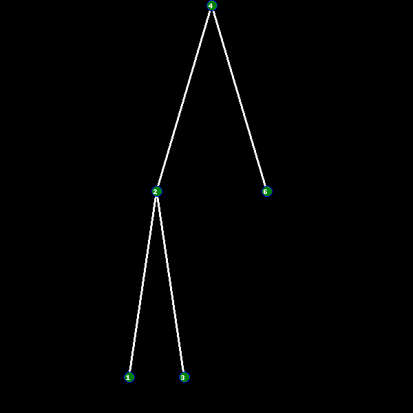

# Python implementation and interface of AVL Tree

### Python efficient look-up data structure

AVL tree data structure that has worst case look-up time complexity $O(log(n))$ and supports the following operations: 
* Inserting elements
* Removing elements
* Looking up elements
* Returning all elements
* Returning max and min elements
* Retreiving internal structure of the tree as text
* Retreiving internal structure of the tree as image

### Installation
The package can be downloaded via Github. To use the data structure in your projects, import AVLInterface class from *TreeInterface.py*

### Documentation
See the comments to the functions in *TreeInterface.py* for clarifications. Additionally, there are vast examples of usage present in *TreeInterfaceExample.py*

### Roadmap

* The API of this library is frozen.
* Version numbers adhere to [semantic versioning][sv].

The only accepted reason to modify the API of this package
is to handle issues that can't be resolved in any other
reasonable way.

Nikita Suprun – [suprun](https://gits-15.sys.kth.se/suprun)

[sv]: http://semver.org/
